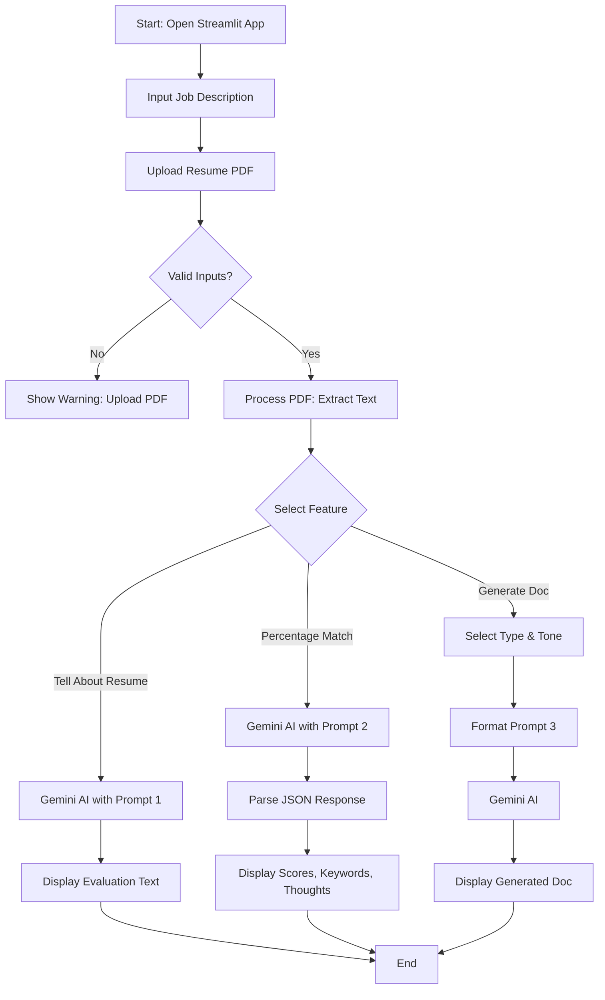

# AI-Powered-ATS-System

<video autoplay loop muted playsinline width="800">
  <source src="review.mp4" type="video/mp4">
</video>

# Overview

This project is an AI-driven Applicant Tracking System (ATS) built using Streamlit and Google Gemini AI. It helps job seekers evaluate their resumes against job descriptions, providing insights on alignment, match percentages, missing keywords, and actionable suggestions. Additionally, it generates tailored cover letters or application emails in various tones (Formal, Enthusiastic, Concise).
The system simulates an experienced HR manager and ATS scanner, leveraging AI to highlight strengths, weaknesses, and improvements. It's ideal for candidates in fields like AI, Data Science, Machine Learning, and Data Analysis, but can be adapted for others.

# Features

- **Resume Evaluation:** Upload a PDF resume and input a job description to get a professional review of strengths and weaknesses.
- **Percentage Match Analysis:** Calculates an overall match score (0-100) with breakdowns for sections like structure, content quality, keywords/skills, and formatting. Includes missing keywords and final thoughts with suggestions.
- **Cover Letter/Email Generator:** Automatically creates customized cover letters or emails based on the resume, job description, and selected tone. Supports concise formats for quick applications.
- **User-Friendly Interface:** Built with Streamlit for an interactive web app experience, including progress bars, metrics, and clean layouts.
- **AI Integration:** Powered by Google Gemini (gemini-2.5-flash) for natural language processing and generation.

# Tech Stack

- **Frontend:** Streamlit (for UI and interactivity)
- **Backend:** Python with Google Generative AI (Gemini API)
- **PDF Processing:** PyMuPDF (fitz) for extracting text from PDFs
- **Environment Management:** python-dotenv for API keys
- **Other Libraries:** json, re (for parsing AI responses), PIL (for image handling if extended)
- **Deployment:** Easily deployable on Streamlit Sharing, Heroku, or locally.

# Installation

Clone the project

```bash
  git clone https://github.com/faarhaanfaarooq/AI-Powered-ATS-System
```

Go to the project directory

```bash
  cd ai-powered-ats-system
```

Install dependencies

```bash
python -m venv venv
source venv/bin/activate  # On Windows: venv\Scripts\activate
pip install -r requirements.txt
```

Set Up Environment Variables:
Create a .env file in the root directory and add your Google Gemini API key:

```bash
  GOOGLE_API_KEY=your-api-key-here
```

Run the App

```bash
  streamlit run app.py
```

# Usage

1. **Input Job Description:** Paste the job description into the text area.
1. **Upload Resume:** Upload your resume as a PDF file.
1. **Analyze Resume:**

- Click "Tell me about the resume" for a qualitative evaluation (strengths, weaknesses).
- Click "Percentage match" for a quantitative score, section breakdowns, missing keywords, and suggestions.

4. **Generate Documents:**

- Select document type (Cover Letter or Email) and tone (Formal, Enthusiastic, Concise).
- Click "Generate Cover Letter / Email" to get a tailored output.

The app provides real-time feedback and displays results with metrics and progress bars for easy visualization.

# Flowchart Diagram

The app processes the resume PDF by extracting text using PyMuPDF, then sends it to Google Gemini AI along with the job description and a custom prompt. Responses are parsed (e.g., JSON for match scores) and displayed via Streamlit components.

- **Prompts:** Defined in prompt.py for evaluation, scoring, and generation.
- **Backend Logic:** Handles API calls and PDF setup in backend.py.
- **Frontend:** Manages UI, inputs, and outputs in app.py.



## Contributing

Contributions are welcome! Fork the repo, create a branch, and submit a pull request. Please follow standard Python coding conventions.

## Acknowledgements

- Built with [Streamlit](https://streamlit.io/) for rapid prototyping.
- Powered by [Google Gemini AI](https://ai.google.dev/?authuser=1).
- Inspired by real-world ATS systems for job applications.
  If you find this project useful, give it a ⭐ on GitHub! For questions, open an issue.
